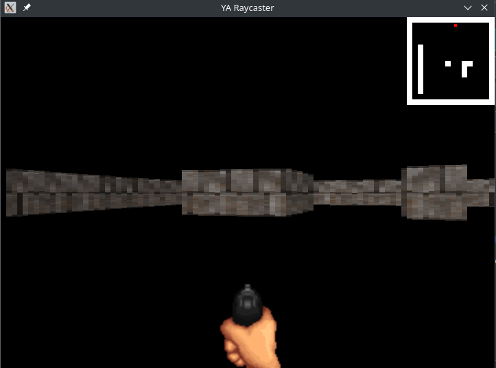

A raycaster written in Rust using SDL2 graphics library



## Requirements
The packages below
```
base-devel
sdl2
sdl2_image 
```

## Compiling and Running the Examples

Once you have the packages below installed along with rust, you can build the raycaster using
```
cargo build
```

## References
https://lodev.org/cgtutor/raycasting.html \
https://permadi.com/1996/05/ray-casting-tutorial-table-of-contents/

## Game Assets
Textures: \
https://screamingbrainstudios.itch.io/tiny-texture-pack?download \
https://opengameart.org/content/lab-sprites

Sounds: \
https://opengameart.org/content/light-machine-gun \
https://opengameart.org/content/big-explosion